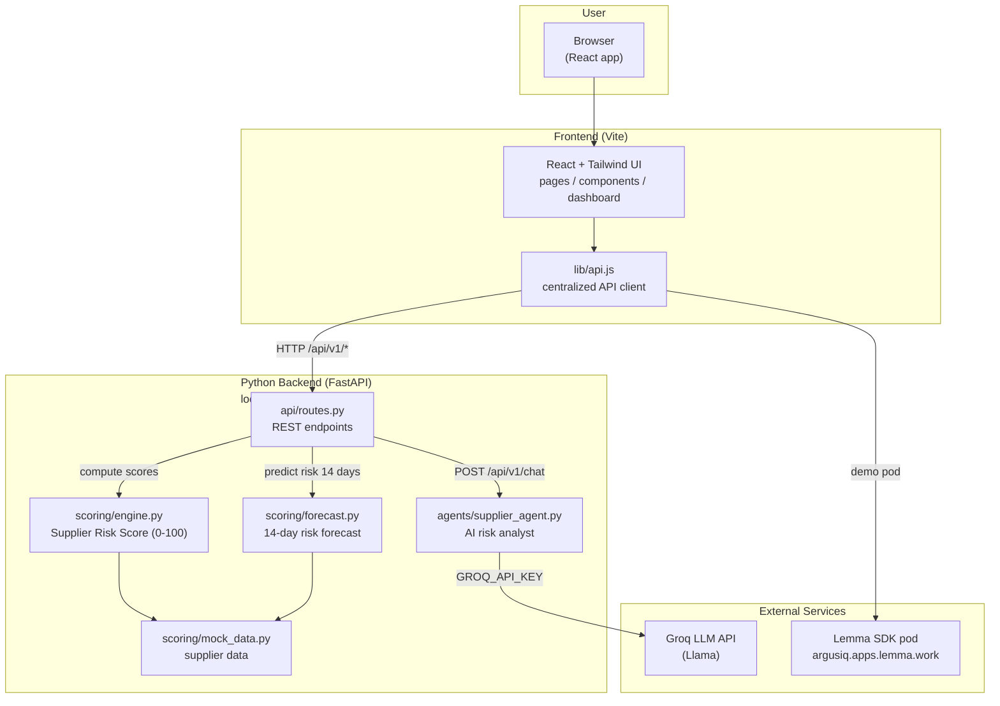

# ArgusIQ

ArgusIQ is an AI-powered supplier risk intelligence platform built for Indian e-commerce sellers, designed to flag supplier disruptions before they impact orders. The backend is built entirely in Python using FastAPI, with a dedicated scoring engine that computes a composite Supplier Risk Score across operational, financial, compliance, and sentiment signals, and an agents layer that powers AI-driven risk analysis using the Groq LLM API (Llama). The service is deployed on Railway, exposing portfolio, supplier detail, alerts, and comparison endpoints. Alongside this, ArgusIQ runs a live demo pod on Lemma SDK (https://argusiq.apps.lemma.work/), showcasing the supplier roster, real-time SRS scoring, and a conversational RiskAnalyst agent built directly on Lemma's agent and data infrastructure - demonstrating end-to-end SDK usage for the hackathon's demoable suppliers

---

## Features

-  Interactive security dashboard
-  AI-assisted threat analysis
-  Real-time risk monitoring and visualization
-  Threat insights and analytics
-  Modern, responsive user interface
-  Fast and intuitive user experience

---

## Tech Stack

### Frontend
- React
- TypeScript
- Vite
- Tailwind CSS
- React Router
- Recharts
- HTML

### Backend
- Node.js
- Express.js

### AI / Services
- OpenAI API 
- REST APIs

---

## Project Structure

```
ArgusIQ/
│
├── frontend/
├── backend/
└── README.md
```

---

## Architecture



---

##  Getting Started

### 1. Clone the repository

```bash
git clone https://github.com/yourusername/argusiq.git
cd argusiq
```

---

## Install Dependencies

### Frontend

```bash
cd frontend
npm install
```

### Backend

The backend lives at the repo root (not in a `backend/` folder). Install Python dependencies once:

```bash
cd D:\ArgusIQ   # or wherever you cloned the repo
pip install -r requirements.txt
```

### API Key (for the AI Assistant tab)

Create a `.env` file in the repo root with your Groq key:

```bash
GROQ_API_KEY=your_groq_api_key_here
```

Without it, the Assistant falls back to pre-scripted demo answers.

---

## Running the Project

### Start the Backend

Open a terminal in the repo root and run:

```bash
uvicorn main:app --reload
```

or explicitly with Python:

```bash
python -m uvicorn main:app --reload
```

The API will be available at http://localhost:8000 (docs at http://localhost:8000/docs).

### Start the Frontend

Open another terminal and run:

```bash
cd frontend
npm run dev
```

The frontend will usually be available at:

```
http://localhost:5173
```

### Start Backend + Frontend Together (Optional)

From the repo root, one command starts both servers:

```bash
npm run dev
```

This uses `concurrently` to launch the backend (`uvicorn main:app --reload`) and the frontend (`npm run dev` inside `frontend/`) in the same terminal. You can also start them individually with `npm run dev:backend` and `npm run dev:frontend`.

> Note: the backend is Python (FastAPI), not Node.js — so there is no `npm start` for it. Use `uvicorn` (or `python -m uvicorn main:app --reload`) from the repo root instead.

---

##  Dependencies

### Frontend

- React
- React DOM
- Vite
- TypeScript
- Tailwind CSS
- React Router DOM
- Axios
- Recharts
- Lucide React

### Backend

- FastAPI
- Uvicorn
- CORS Middleware
- python-dotenv
- Groq LLM API (Llama via api.groq.com)

### Deployment

- **Backend** → Railway (FastAPI + uvicorn, `Procfile` at repo root)
- **Frontend** → Vercel (static build of the `frontend/` app)

---

## Deploying the Frontend to Vercel

The frontend is a pure Vite/React static site, so it deploys to Vercel in minutes:

1. **Import the repo** in Vercel and set the **Root Directory** to `frontend`.
   (Vercel auto-detects the Vite framework; `frontend/vercel.json` already adds SPA rewrites so `/dashboard`, `/login`, etc. work without a 404.)
2. **Set the API URL** — add this build-time environment variable in Vercel (Project → Settings → Environment Variables):

   ```
   VITE_API_BASE_URL=https://your-app.up.railway.app/api/v1
   ```

   Without it the browser falls back to `http://localhost:8000/api/v1` and the dashboard/alerts/chat show errors.
3. **Deploy from `main`** — every push to `main` triggers a production deployment.

> The Python backend is **not** deployed to Vercel — it stays on Railway. Vercel only hosts the static frontend, which talks to the Railway API over HTTPS (CORS is already wide open in `main.py`).

See `.env.example` at the repo root for all environment variables.

---

## Screenshots

### Dashboard


### Demo Video


---

##  Future Enhancements

- Multi-user authentication
- Role-based access control
- Dark mode
- Predictive threat detection
- Cloud deployment
- Exportable security reports

---

##  Team

- Raashi Dhamange
- Sarah Parekh
- Suzanne Daniel Thomas

---
## Lemma SDK Integration

ArgusIQ uses Lemma SDK as a secondary intelligence layer alongside our FastAPI backend:
- **Lemma Table**: Supplier risk data mirrored from our scoring engine
- **Lemma Agent (RiskAnalyst)**: Natural language Q&A over supplier risk data
- **Lemma App**: Live pod interface for risk queries

Live pod: https://argusiq.apps.lemma.work/

## 📄 License

This project was developed as part of a hackathon and is intended for educational and demonstration purposes.
