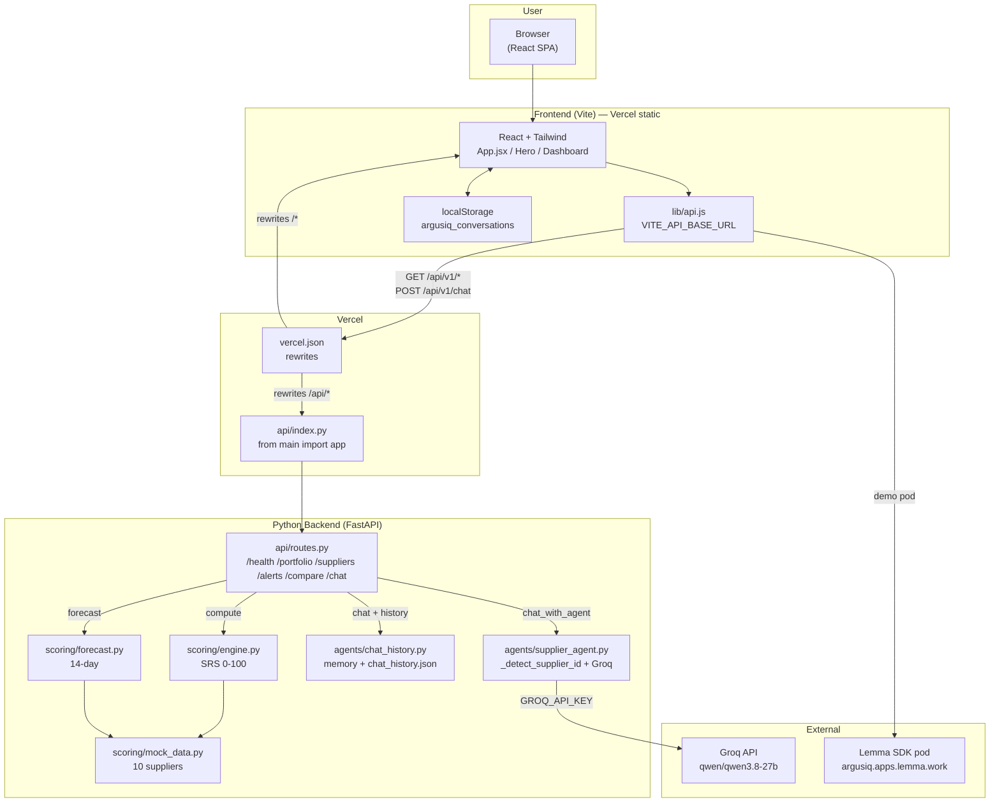
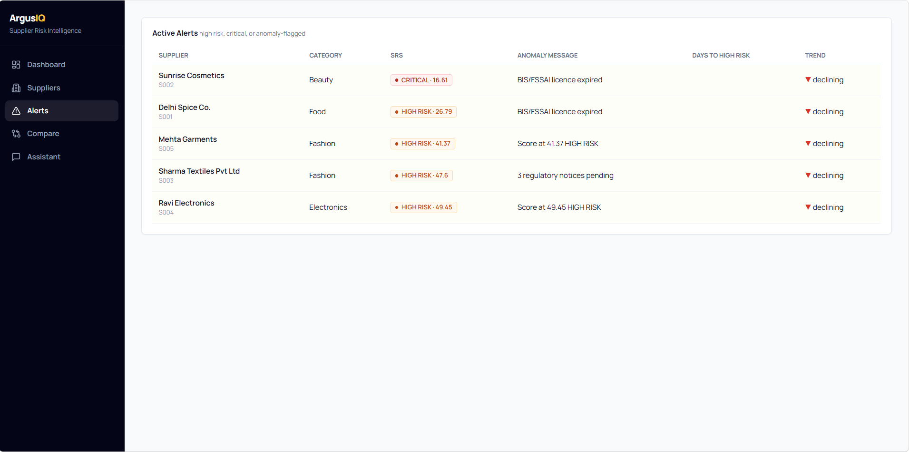
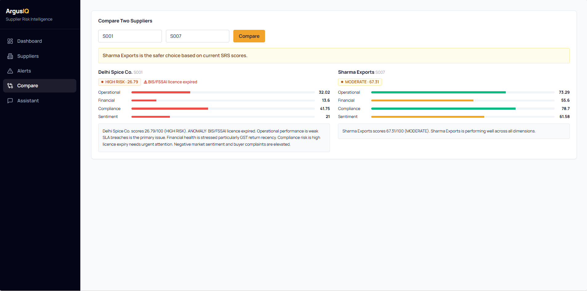
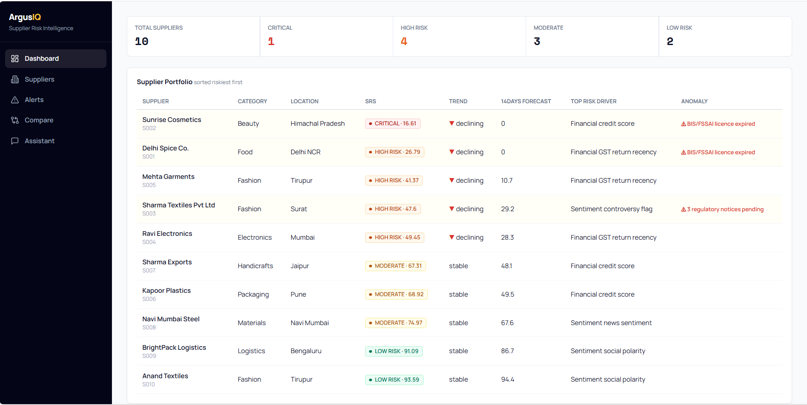
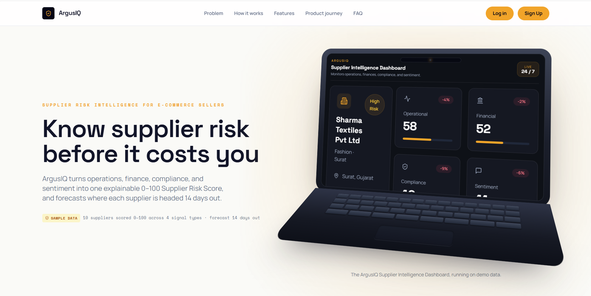
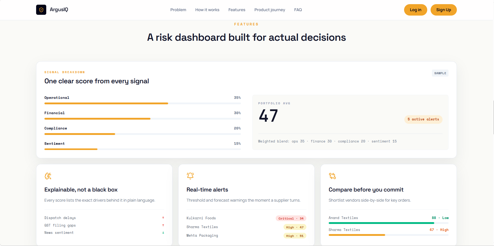
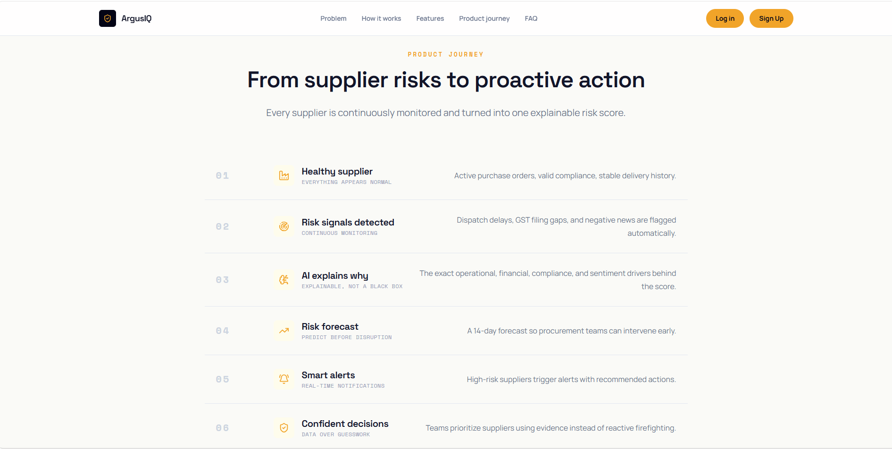
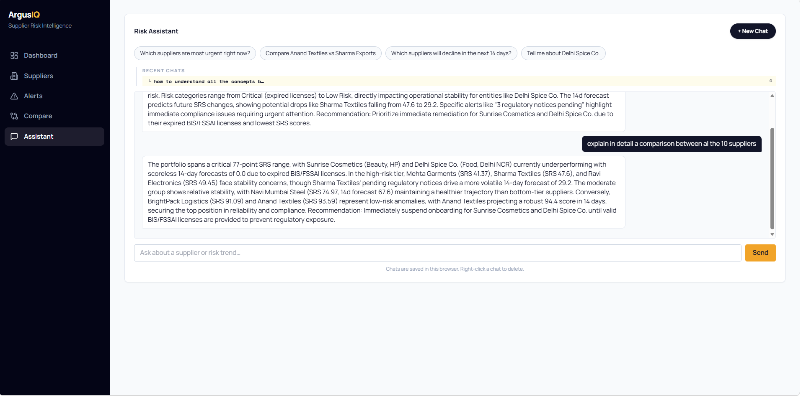

# ArgusIQ

AI-powered supplier risk intelligence for Indian e-commerce sellers. ArgusIQ computes a 0–100 **Supplier Risk Score (SRS)** across Operational (35%), Financial (30%), Compliance (20%) and Sentiment (15%), forecasts risk 14 days ahead, and exposes it through a FastAPI backend and a Vite + React dashboard with a Groq-powered Risk Assistant. Also ships a live Lemma SDK demo pod at `https://argusiq.apps.lemma.work/`.

---

## Features

- **Supplier Risk Intelligence** — Composite SRS with sub-scores, anomaly caps, and plain-English explanations
- **14-Day Forecast** — Linear-regression trend with `days_to_high_risk`
- **Portfolio Dashboard** — Sortable risk table, supplier detail, alerts, and side-by-side compare
- **Risk Assistant (AI Chat)** — Groq `qwen/qwen3.8-27b` with full portfolio context, supplier-name detection, pre-scripted fallbacks, and grounded answers when the LLM is down
- **Chat History** — GPT-style conversations (auto-titled from first message), recent-chats tree under Assistant, `localStorage` + backend `chat_history.json` (`/tmp` fallback on Vercel), right-click to delete, `New Chat` keeps history
- **TimeMax-style Landing** — Fixed mono nav (Problem / How it works / Features / Product Journey / FAQ), open-laptop mockup with scaled `DemoScreen`, one-line headings, balanced bento grid
- **Responsive + Animated** — Tailwind CSS, Framer Motion, Recharts

---

## Tech Stack

### Frontend (`frontend/`)
- **React 18** + **Vite 6** (build tool, HMR)
- **Tailwind CSS 3** + **Framer Motion 11** + **Lucide React**
- **React Router 7** (SPA routing)
- **Recharts 2** (RiskChart, SignalGrid)

### Backend (repo root)
- **Python 3.14** + **FastAPI** + **Uvicorn** (ASGI)
- **Pydantic 2** (validation), **python-dotenv**, **requests** (Groq calls)
- **Groq API** `qwen/qwen3.8-27b` via `https://api.groq.com/openai/v1/chat/completions`
- **Scoring engine** (`scoring/engine.py`) + **Forecast** (`scoring/forecast.py`) on `scoring/mock_data.py` (10 suppliers)

### Deployment
- **Vercel** — single deployment: `frontend/dist` static + `api/index.py` serverless (`vercel.json` rewrites). Env `VITE_API_BASE_URL=/api/v1` (same-origin) and `GROQ_API_KEY` in Vercel dashboard.

---

## Project Structure

```
ArgusIQ/
├── main.py                     # FastAPI app (CORS, /api/v1 router, /)
├── requirements.txt            # Python deps
├── vercel.json                 # Vercel: build frontend, rewrite /api/* → api/index.py, SPA → /index.html
├── .env.example                # GROQ_API_KEY + VITE_API_BASE_URL=/api/v1 template
├── api/
│   ├── routes.py               # GET /health, /portfolio, /suppliers/{id}, /alerts, /compare, POST /chat, GET|DELETE /chat/history
│   └── index.py                # Vercel entry: from main import app
├── scoring/
│   ├── engine.py               # compute_srs() weighted composite + anomaly cap
│   ├── forecast.py             # forecast_14_days() linear regression
│   └── mock_data.py            # 10 suppliers (Delhi Spice … Anand Textiles) + get_all_suppliers()
├── agents/
│   ├── supplier_agent.py       # Groq call, _detect_supplier_id(), FALLBACKS, build_context(), chat_with_agent()
│   └── chat_history.py         # In-memory + chat_history.json (/tmp fallback), get/add/clear
├── frontend/
│   ├── index.html
│   ├── vite.config.js          # base "/" (keep for Vercel/Render)
│   ├── tailwind.config.js
│   ├── vercel.json             # legacy frontend-only fallback (SPA rewrites)
│   ├── src/
│   │   ├── App.jsx             # BrowserRouter: / → landing, /dashboard/*, /login, /signup
│   │   ├── main.jsx
│   │   ├── styles.css          # Manrope + Space Grotesk + Space Mono, laptop-mockup styles
│   │   ├── lib/api.js          # BASE_URL = import.meta.env.VITE_API_BASE_URL || http://localhost:8000/api/v1
│   │   ├── pages/Dashboard.jsx # Tabs: Overview | Suppliers | Alerts | Compare | Chat
│   │   ├── components/
│   │   │   ├── Hero.jsx        # Fixed nav + 2-col hero + LaptopMockup<DemoScreen>
│   │   │   ├── LaptopMockup.jsx# TimeMax open-laptop (notch, glare, keyboard, display)
│   │   │   ├── DemoScreen.jsx  # Compact 12-col preview (SupplierCard, SignalGrid, RiskChart…)
│   │   │   ├── Problem.jsx     # 3 cards (Late/No warning/Revenue leakage)
│   │   │   ├── Solution.jsx    # 3 steps (Connect → Read → Score+forecast)
│   │   │   ├── Features.jsx    # Bento: Signal breakdown + Explainable + Alerts + Compare + Metrics band
│   │   │   ├── Proof.jsx, Timeline.jsx, FAQ.jsx, CTA.jsx, Footer.jsx
│   │   │   └── dashboard/      # DashboardOverview, SuppliersList, SupplierDetail, AlertsList, Comparetab, Chattab
│   │   └── data/demoData.js
│   └── public/favicon.svg
└── PROJECT_GUIDE.md            # Deep-dive + Iteration 2/3 teacher notes
```

---

## Architecture



`vercel.json` at repo root builds `frontend` and proxies ` /api/*` to the Python function; `frontend/vercel.json` is the legacy frontend-only fallback.

---

## Screenshots

> Auto-generated gallery — do not edit between the markers by hand. Paste new image files into `screenshots/` (descriptive names like `dashboard-overview.png`) and run `python scripts/update_screenshots.py` to refresh this section.

<!-- SCREENSHOTS:START -->
### Alerts



Alerts tab — high-risk, critical and anomaly-flagged suppliers with anomaly message and trend.

### Comparison Suppliers



Compare tab — Delhi Spice Co. vs Sharma Exports side-by-side sub-scores with a safer-choice recommendation.

### Dashboard



Dashboard overview — portfolio counts by risk band with the full supplier table sorted riskiest first.

### Landing 1



Landing hero — "Know supplier risk before it costs you" with the live Supplier Intelligence Dashboard inside the laptop mockup.

### Landing 2



Features bento — signal-breakdown weights with portfolio average, explainability drivers, real-time alerts and side-by-side comparison.

### Landing 3 Product Journey



Product journey — six stages from a healthy supplier to confident, evidence-based decisions.

### Risk Assistant



Risk Assistant — Groq-powered chat with suggestion chips, persisted conversations and recent-chats history.
<!-- SCREENSHOTS:END -->

---

## Getting Started

### 1. Clone

```bash
git clone https://github.com/suzannet-menon/ArgusIQ.git
cd ArgusIQ
# or: https://github.com/dhamangeraashi-bit/ArgusIQ.git
```

### 2. Install Dependencies

**Backend** — repo root (Python, not `backend/`):
```bash
pip install -r requirements.txt
```

**Frontend:**
```bash
cd frontend
npm install
cd ..
```

### 3. API Key (for Risk Assistant)

Create `.env` at repo root:
```bash
GROQ_API_KEY=gsk_...        # https://console.groq.com/keys
VITE_API_BASE_URL=/api/v1   # same-origin on Vercel; localhost fallback is http://localhost:8000/api/v1
```
Without a key, chat falls back to pre-scripted answers and grounded `build_context()` data. See `PROJECT_GUIDE.md:12.7` for 5-step Groq debugging (key loaded? → `GET /models` → `POST` model alive? → supplier detection? → Vercel env).

---

## Running the Project

### Backend only
```bash
# from D:\ArgusIQ
python -m uvicorn main:app --reload
# → http://localhost:8000  docs at /docs
```
> Use `python -m uvicorn` (not bare `uvicorn`) — on Windows the `Scripts/` folder is usually not on `PATH`, so bare `uvicorn` fails with "not recognized".

### Frontend only
```bash
cd frontend
npm run dev
# → http://localhost:5173
```

### Both together (one terminal)
```bash
npm run dev              # concurrently: backend (blue) + frontend (green)
# also: npm run dev:backend / npm run dev:frontend
```

> The backend is Python — `npm start` will not work for it. `npm run dev:backend` runs `python -m uvicorn main:app --reload` from the repo root.

### Login / Signup (dummy for now)

`/login` and `/signup` are **UI-only placeholders** — any email logs you in locally, no password is checked, nothing is stored server-side. Real authentication (DB users, hashed passwords, JWT) is being worked on; see `PROJECT_GUIDE.md:7.1` and `13` for the plan.

---

## Dependencies

### Frontend (`frontend/package.json`)
- `react`, `react-dom`, `vite`, `@vitejs/plugin-react`
- `tailwindcss`, `autoprefixer`, `postcss`
- `react-router-dom`, `framer-motion`, `lucide-react`, `recharts`

### Backend (`requirements.txt`)
- `fastapi`, `uvicorn[standard]`, `starlette`, `pydantic`, `python-dotenv`, `requests`, `anyio`, `numpy`, `pandas`

### Deployment
- **Vercel (recommended, together):** `vercel.json` at root builds `frontend/dist` and runs `api/index.py` as serverless. Set `VITE_API_BASE_URL=/api/v1` + `GROQ_API_KEY` in Vercel → Settings → Environment Variables.
- **Split:** Frontend → Vercel/Netlify (Root Directory `frontend`), Backend → Render/Fly.io (`uvicorn main:app --host 0.0.0.0 --port $PORT`). Then set `VITE_API_BASE_URL=https://<backend>/api/v1`.

---

## Deploying to Vercel (Together)

1. Push to GitHub, **Import** in Vercel — it auto-detects `framework: vite` via `vercel.json`.
2. **Environment Variables** (Production):
   ```
   VITE_API_BASE_URL=/api/v1
   GROQ_API_KEY=gsk_...
   ```
3. **Deploy** — every push to `main` redeploys. Check `vercel logs` for `[ArgusIQ AI] Groq API failed: ...` if chat falls back.

`python.terminal.useEnvFile` warning in VS Code on saving `.env` → set `"python.terminal.useEnvFile": true` in `.vscode/settings.json` to auto-inject `.env` into integrated terminals.

---

## Future Enhancements

- Real Postgres (`Supabase`/`Neon`) + `SQLAlchemy` + `Alembic` (see `PROJECT_GUIDE.md:13`)
- JWT auth + multi-tenant `tenant_id`
- `score_history` table for 90-day forecast + `Prophet`/`LSTM`
- PDF export, dark mode, email/SMS alerts, `Vercel Cron` scoring job
- See `PROJECT_GUIDE.md:7-8` for study paths

---

## Team

- Raashi Dhamange
- Sarah Parekh
- Suzanne Daniel Thomas

---

## Lemma SDK Integration

- **Lemma Table:** Supplier risk mirrored from `scoring/engine.py`
- **Lemma Agent (RiskAnalyst):** NL Q&A over risk data
- **Lemma App:** `https://argusiq.apps.lemma.work/`

## License

Hackathon — educational/demo purposes.
